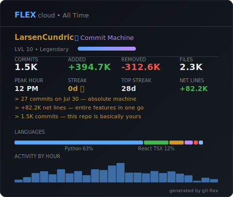

# git-flex

Show off your coding stats in style. Run `flex` in any git repo and get a beautiful terminal card with your stats, streaks, and personalized highlights.

<p align="center">
  
</p>

## Install

```bash
npm install -g git-flex
```

Or try it without installing:

```bash
npx git-flex
```

## Usage

```bash
# Today's stats
flex

# This week / month / all time
flex week
flex month
flex all

# Compare with a teammate
flex vs @teammate

# Team leaderboard
flex team

# Commit streak
flex streak

# Language breakdown
flex langs

# Generate a shareable SVG card
flex card
flex card --light
flex card --dark -o my-card.svg
```

## What You Get

- **Commits, lines added/removed, net lines, files touched**
- **Language breakdown** with visual bars
- **Peak coding hour** — when you're most productive
- **Commit streak** — current and all-time best
- **Fun rank** based on your patterns: Night Owl, Bug Slayer, Commit Machine, Code Surgeon...
- **Level system** — Newcomer to Legendary based on commit volume
- **Personalized highlights** — auto-generated one-liners based on your actual data:
  - *"250 weekend commits... touch grass"*
  - *"8 Friday afternoon deploys — lives dangerously"*
  - *"Deleted more than you wrote — mass cleanup arc"*
  - *"+82K net lines — entire features in one go"*
  - *"If you leave, this repo is cooked"*

## SVG Card

Generate a card you can embed in your GitHub README or share anywhere:

```bash
flex card              # dark theme (default)
flex card --light      # light theme
flex card -o stats.svg # custom output file
```

Then add it to your README:

```markdown

```

## Requirements

- Node.js >= 18
- Git

## License

MIT
